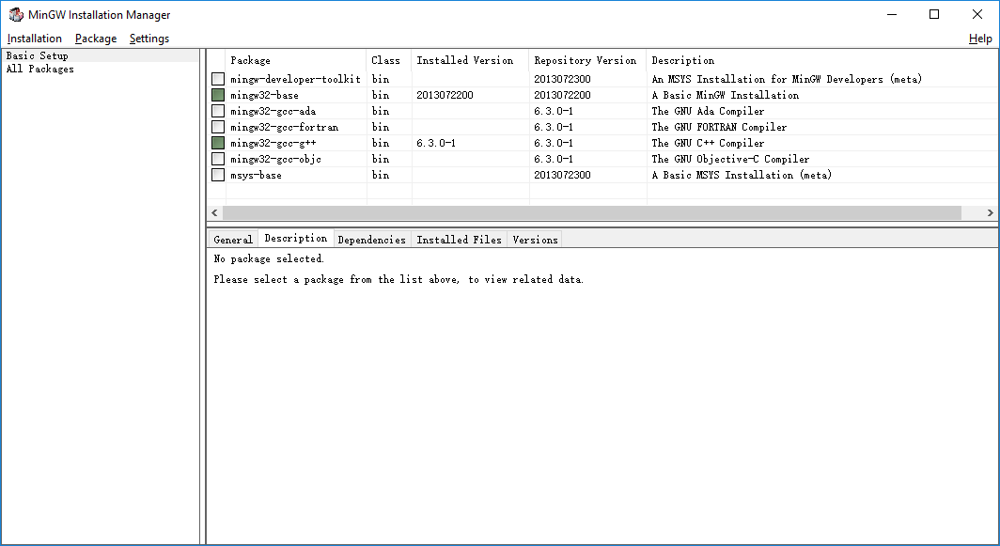
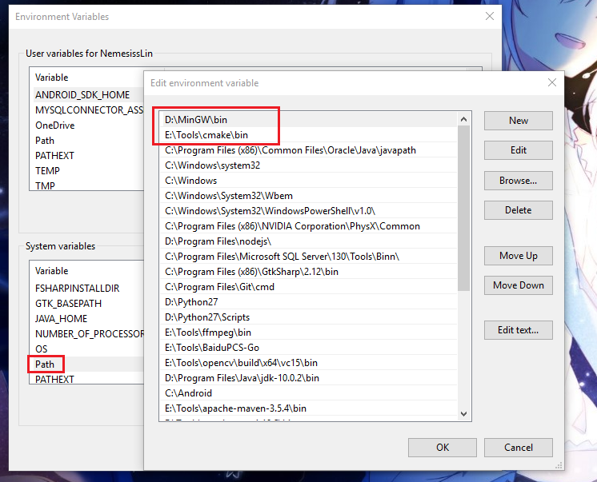
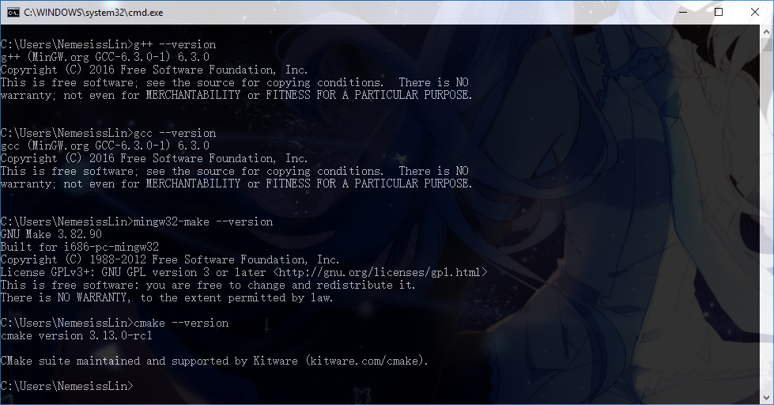

# Coding Complex C++ Project in Windows with VSCode

## Introduction

As we all know, there are many tools, or can say a toolchain that can help us coding cpp project in Linux elegantly. We use CMake, autoconf, to generate Makefile automatically, gcc/g++ to complie our project, gdb to pause our program at breakpoint to process some debug works. But in Windows, this toolchain seems to face with some platform compatibility problems.

I had tried so many ways to let these tools work with my favourite text editor VSCode, finally after deep-autumn afternoon nap, I got it.

## Steps

### 1. Download and Install MinGW in your system.

Go to [MinGW official download page](https://osdn.net/projects/mingw/releases/) to download a <code>MinGW Installation Manager (mingw-get)</code>. Chinese guys may need to download it with a scientific ways.

When you finish downloading this install helper, run it.

You may need to set a path(1) to install component later. Plz <strong>remember</strong> it and place them in a path with a <strong>English</strong> name.

and you can see a window like below.



Check the checkbox like the screenshot above, and you can install other components if needed.

Click <code>Installation</code> in the taskbar and select ``` Apply changes``` to start installation.

### 2. Download CMake

<strong>Tips : You can also use any makefile generator or write it yourself</strong>

Go to [CMake official download page](https://cmake.org/download/) to download it. Choose the download link at the right of some words like "Windows win64-x64 ZIP".

Unzip this zip in another path(2) only with English pathname.

### 3. Configure Environment Variables

Just do it like the screenshot. The path on the screenshot is my path. You should enter the correct path 1 and 2 mentioned above in "Path".


When you finish this step, open a cmd, tap
```
g++ --version

gcc --version

mingw32-make --version

cmake --version
```
you should receive output like below.



### 4. Configure VSCode and do some test.

Open your VSCode and new a folder to make a test.

Download a VSCode extension named "C/C++", and restart it.

Our test project strcture is here : 

<strong>Notice : This guidance won't show you what it means about ```CMakeLists.txt```. If you want to learn more about CMake, plz refer to its docs.</strong>

```
+-- TestProject
  +-- Header
    -- Relax.h
  +-- src
    -- Relax.cpp
  -- main.cpp
  -- CMakeLists.txt
```

Relax.h : 
```
void Relaxer();
```

Relax.cpp : 
```
#include "../Header/Relax.h"
#include <functional>
#include <typeinfo>
#include <iostream>
void Relaxer()
{
    std::function<void(void)> RelaxFunction = []()->void
    {
        std::cout << "Hello, MinGW" << std::endl;
    };
    //use lambda expression to test c++14 standards.
    RelaxFunction();
}
```

main.cpp : 
```
#include "Header/Relax.h"
int main(void)
{
    Relaxer();
    return 0;
}
```

CMakeLists.txt
```
cmake_minimum_required (VERSION 2.8)

set(CMAKE_CXX_FLAGS "${CMAKE_CXX_FLAGS} -std=c++14") # Support C++14
set(CMAKE_CXX_FLAGS_DEBUG "$ENV{CXXFLAGS} -O0 -Wall -g -ggdb") ## Add debug flags
set(CMAKE_CXX_FLAGS_RELEASE "$ENV{CXXFLAGS} -O3 -Wall")

project (TestProject)
aux_source_directory(./src PROJECT_SRC)
aux_source_directory(./Header PROEJCT_HEADER)
add_library (LINKER ${PROJECT_HEADER} ${PROJECT_SRC})
add_executable(Test ./main.cpp)
target_link_libraries(Test LINKER)
```

Tap 
```
cmake -D CMAKE_BUILD_TYPE=Debug . -G "MinGW Makefiles"
```

in the terminal to build this project.

and 
```
make
```
to generate executable files ```Test.exe```

Then, in the VSCode, click Debug -> Start Debugging -> C++(GDB/LLDB)

launch.json
```
{
    // Use IntelliSense to learn about possible attributes.
    // Hover to view descriptions of existing attributes.
    // For more information, visit: https://go.microsoft.com/fwlink/?linkid=830387
    "version": "0.2.0",
    "configurations": [
        {
            "name": "(gdb) Launch",
            "type": "cppdbg",
            "request": "launch",
            "program": "${workspaceFolder}/Test.exe",
            "args": [],
            "stopAtEntry": false,
            "cwd": "${workspaceFolder}",
            "environment": [],
            "externalConsole": true,
            "MIMode": "gdb",
            "miDebuggerPath": "D:/MinGW/bin/gdb.exe",
            "setupCommands": [
                {
                    "description": "Enable pretty-printing for gdb",
                    "text": "-enable-pretty-printing",
                    "ignoreFailures": true
                }
            ],
            "preLaunchTask": "CMAKE"
        }
    ]
}
```

task.json

```
{
    // See https://go.microsoft.com/fwlink/?LinkId=733558
    // for the documentation about the tasks.json format
    "version": "2.0.0",
    "tasks": [
        {
            "label": "CMAKE",
            "type": "shell",
            "command": "cmake -D CMAKE_BUILD_TYPE=Debug . -G \"MinGW Makefiles\""
        }
    ]
}
```

Voilà! VSCode will stop at a breakpoint, showing variable info correctly like below.